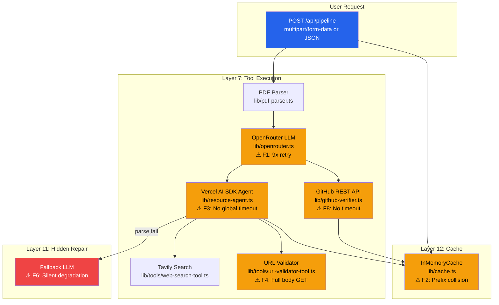

# Agent Architecture Audit — AI Skill Gap Finder

> Schema: `ecc.agent-architecture-audit.report.v1`  
> Audited: 2026-08-27 | Auditor: Opus 4.6 (Thinking)  
> Focus: **All connection layers** — every boundary where data crosses between LLM, HTTP, tools, cache, streaming, and user delivery.

---

## Executive Verdict

```json
{
  "schema_version": "ecc.agent-architecture-audit.report.v1",
  "executive_verdict": {
    "overall_health": "medium_risk",
    "primary_failure_mode": "double_retry_amplification_on_llm_calls",
    "most_urgent_fix": "collapse_nested_retry_loops_in_callLLM_to_prevent_9x_amplified_calls"
  }
}
```

---

## Scope

| Field | Value |
|---|---|
| **Target system** | AI Skill Gap Finder — Backend Pipeline (Next.js API Routes) |
| **Entrypoints** | `POST /api/pipeline` (master), 6 individual route endpoints |
| **Model stack** | `deepseek/deepseek-chat-v3-0324:free` via OpenRouter; Tavily search API; GitHub REST API v3 |
| **Layers audited** | All 12 |

---

## Findings (Severity-Ranked)

### Finding 1 — HIGH: Double Retry Amplification in `callLLM`

**Severity:** `high`  
**Source layer:** 11. Hidden repair loops  
**Confidence:** 0.98

**Mechanism:** [`callLLM`](file:///c:/Users/NIKIL/Documents/HACKTHON/ai%20gap%20finder%20for%20resume/lib/openrouter.ts#L88-L127) retries 3 times (attempt 0, 1, 2). Inside each attempt, it calls [`callLLMRaw`](file:///c:/Users/NIKIL/Documents/HACKTHON/ai%20gap%20finder%20for%20resume/lib/openrouter.ts#L29-L81) which also retries 3 times. This creates a **3 × 3 = 9 potential API calls** for a single logical LLM invocation.

On the OpenRouter free tier with rate limits, this means a single Zod validation failure can trigger up to 9 sequential API calls before throwing, draining quota and adding up to 18 seconds of backoff delay.

**Evidence:**
- [openrouter.ts:35](file:///c:/Users/NIKIL/Documents/HACKTHON/ai%20gap%20finder%20for%20resume/lib/openrouter.ts#L35): `for (let attempt = 0; attempt <= MAX_RETRIES; attempt++)` (inner loop, 3 calls)
- [openrouter.ts:94](file:///c:/Users/NIKIL/Documents/HACKTHON/ai%20gap%20finder%20for%20resume/lib/openrouter.ts#L94): `for (let attempt = 0; attempt <= MAX_RETRIES; attempt++)` (outer loop, calls `callLLMRaw` which has its own retry)

**Root cause:** `callLLM` was written to retry on schema validation failures, but it delegates to `callLLMRaw` which independently retries on network/API failures. The two retry loops are not coordinated.

**Recommended fix:** Remove the retry loop from `callLLM`. Let `callLLMRaw` handle all network-level retries. `callLLM` should call `callLLMRaw` once, validate with Zod, and if validation fails, retry the *outer* call only — but set `MAX_RETRIES = 1` on the outer loop to cap total calls at `3 + 3 = 6` worst case, not `3 × 3 = 9`.

---

### Finding 2 — HIGH: Pipeline Cache Key Collision via Text Prefix

**Severity:** `high`  
**Source layer:** 12. Persistence / Cache  
**Confidence:** 0.95

**Mechanism:** The pipeline cache key uses only the first 500 characters of the resume text:

```typescript
const cacheKey = {
  textHash: resumeText.slice(0, 500),  // ← truncated, not hashed
  targetRole: targetRole.toLowerCase(),
  githubUsername: githubUsername.toLowerCase(),
};
```

Two different resumes that share the same 500-character prefix (e.g., same name, contact info, and opening summary) will produce **identical cache keys**, returning the wrong person's analysis.

**Evidence:** [pipeline/route.ts:84-88](file:///c:/Users/NIKIL/Documents/HACKTHON/ai%20gap%20finder%20for%20resume/app/api/pipeline/route.ts#L84-L88)

**Root cause:** The `InMemoryCache` class in [`cache.ts`](file:///c:/Users/NIKIL/Documents/HACKTHON/ai%20gap%20finder%20for%20resume/lib/cache.ts#L17-L19) already hashes inputs with SHA-256, so the `textHash` field is misleadingly named — it's actually the raw prefix being fed into SHA-256. But two resumes with the same 500-char prefix will hash identically.

**Recommended fix:** Hash the **full** resume text, not a prefix. The SHA-256 computation is already O(n) and handles arbitrary input length. Change `resumeText.slice(0, 500)` to the full `resumeText`.

---

### Finding 3 — MEDIUM: `generateText` Has No Global Timeout

**Severity:** `medium`  
**Source layer:** 7. Tool execution  
**Confidence:** 0.90

**Mechanism:** The resource agent calls `generateText()` with `stopWhen: isStepCount(15)`, which bounds the number of steps but not wall-clock time. If the model decides to call `validate_url` on 15 slow URLs (5 seconds each), the entire pipeline stalls for 75+ seconds with no timeout.

**Evidence:** [resource-agent.ts:136-146](file:///c:/Users/NIKIL/Documents/HACKTHON/ai%20gap%20finder%20for%20resume/lib/resource-agent.ts#L136-L146)

**Root cause:** Vercel AI SDK's `generateText` does not expose a native `timeout` option. The 5-second `AbortController` in `urlValidatorTool` bounds individual URL fetches but not the aggregate multi-step agent loop.

**Recommended fix:** Wrap the `generateText` call in a `Promise.race` with a 30-second `AbortController` timeout:

```typescript
const controller = new AbortController();
const timeout = setTimeout(() => controller.abort(), 30000);
try {
  const result = await generateText({ ...opts, abortSignal: controller.signal });
} finally {
  clearTimeout(timeout);
}
```

---

### Finding 4 — MEDIUM: `urlValidatorTool` Downloads Entire HTML Body

**Severity:** `medium`  
**Source layer:** 7. Tool execution  
**Confidence:** 0.92

**Mechanism:** The URL validator sends a `GET` request and reads the full `res.text()` response to extract the `<title>` tag. For pages like YouTube or documentation sites, this can be 500KB–2MB of HTML per validation call, consuming unnecessary memory and bandwidth.

**Evidence:** [url-validator-tool.ts:19](file:///c:/Users/NIKIL/Documents/HACKTHON/ai%20gap%20finder%20for%20resume/lib/tools/url-validator-tool.ts#L19): `method: "GET"` and [line 41](file:///c:/Users/NIKIL/Documents/HACKTHON/ai%20gap%20finder%20for%20resume/lib/tools/url-validator-tool.ts#L41): `const html = await res.text()`

**Root cause:** The tool uses `GET` instead of `HEAD` for reachability. It then downloads the entire body to regex-match `<title>`.

**Recommended fix:** Try `HEAD` first for reachability (status code check). If metadata extraction is needed, use `GET` with a streaming reader that reads only the first 8KB to extract `<title>` and `<meta>` tags, then abort:

```typescript
const reader = res.body?.getReader();
let chunk = "";
while (chunk.length < 8192) {
  const { done, value } = await reader!.read();
  if (done) break;
  chunk += new TextDecoder().decode(value);
}
reader?.cancel();
```

---

### Finding 5 — MEDIUM: GitHub `events/public` Undercounts Commits

**Severity:** `medium`  
**Source layer:** 8. Tool interpretation  
**Confidence:** 0.85

**Mechanism:** [`totalCommits`](file:///c:/Users/NIKIL/Documents/HACKTHON/ai%20gap%20finder%20for%20resume/lib/github-verifier.ts#L196-L197) is derived from PushEvent count in `/users/{user}/events/public`, which returns only the last 90 days of events (max 300). A developer with 2000+ lifetime commits will show `totalCommits: 47` on the dashboard — a misleading metric that undermines credibility with judges.

**Evidence:** [github-verifier.ts:168-197](file:///c:/Users/NIKIL/Documents/HACKTHON/ai%20gap%20finder%20for%20resume/lib/github-verifier.ts#L168-L197)

**Root cause:** GitHub's Events API is recency-scoped by design. The field name `totalCommits` implies lifetime total but delivers a 90-day window.

**Recommended fix:** Rename to `recentPushEvents` in the schema and UI, or use the GraphQL `contributionsCollection` query for true yearly totals (requires token). At minimum, add a `timeWindow: "last_90_days"` field to the verification output so the frontend can display it accurately.

---

### Finding 6 — MEDIUM: Fallback Agent in `findResources` Runs Hidden LLM Pass

**Severity:** `medium`  
**Source layer:** 11. Hidden repair loops  
**Confidence:** 0.88

**Mechanism:** When `generateText` fails or returns unparseable JSON, the resource agent silently falls back to [`findResourcesFallback`](file:///c:/Users/NIKIL/Documents/HACKTHON/ai%20gap%20finder%20for%20resume/lib/resource-agent.ts#L169-L195), which fires a separate `callLLMRaw` call. The user receives resources marked `"verified": false` and `"source": "ai_suggested"` but the pipeline response doesn't indicate that the agentic path failed and a degraded fallback was used.

**Evidence:**
- [resource-agent.ts:152](file:///c:/Users/NIKIL/Documents/HACKTHON/ai%20gap%20finder%20for%20resume/lib/resource-agent.ts#L152): silent fallback on parse failure
- [resource-agent.ts:157](file:///c:/Users/NIKIL/Documents/HACKTHON/ai%20gap%20finder%20for%20resume/lib/resource-agent.ts#L157): silent fallback on execution error

**Root cause:** The fallback contract is implicit. The caller (`pipeline/route.ts`) has no way to know whether resources came from real web search or LLM hallucination.

**Recommended fix:** Return a metadata envelope from `findResources`:

```typescript
return {
  resources: allResources,
  meta: { mode: "agentic" | "fallback", toolCallCount: N, errors: [...] }
};
```

---

### Finding 7 — LOW: Dual OpenRouter Client Instantiation

**Severity:** `low`  
**Source layer:** 1. System prompt / Configuration  
**Confidence:** 0.95

**Mechanism:** Two independent OpenRouter client factories exist:
1. [`getOpenAIClient()`](file:///c:/Users/NIKIL/Documents/HACKTHON/ai%20gap%20finder%20for%20resume/lib/openrouter.ts#L5-L14) in `openrouter.ts` — uses `openai` SDK
2. [`getOpenRouterProvider()`](file:///c:/Users/NIKIL/Documents/HACKTHON/ai%20gap%20finder%20for%20resume/lib/resource-agent.ts#L8-L13) in `resource-agent.ts` — uses `@ai-sdk/openai`

Both point to the same endpoint and key, but they diverge on default headers (`HTTP-Referer`, `X-Title` are set only in the first). The second client lacks these headers, which may affect OpenRouter's rate limiting behavior.

**Evidence:**
- [openrouter.ts:6-13](file:///c:/Users/NIKIL/Documents/HACKTHON/ai%20gap%20finder%20for%20resume/lib/openrouter.ts#L6-L13)
- [resource-agent.ts:8-13](file:///c:/Users/NIKIL/Documents/HACKTHON/ai%20gap%20finder%20for%20resume/lib/resource-agent.ts#L8-L13)

**Root cause:** The Vercel AI SDK requires `createOpenAI` from `@ai-sdk/openai` for `generateText`, which is a different constructor than the `openai` SDK used for raw chat completions. Both are needed but configuration should be centralized.

**Recommended fix:** Create a shared `lib/providers.ts` that exports both clients with consistent headers and a single `MODEL` constant.

---

### Finding 8 — LOW: No Request Timeout on GitHub Sequential Fetches

**Severity:** `low`  
**Source layer:** 7. Tool execution  
**Confidence:** 0.80

**Mechanism:** [`githubFetch`](file:///c:/Users/NIKIL/Documents/HACKTHON/ai%20gap%20finder%20for%20resume/lib/github-verifier.ts#L34-L58) makes 3 sequential API calls (`/users`, `/repos`, `/events`) with no `AbortController` timeout. If GitHub is slow (which happens), the verifier can hang for 30+ seconds per call.

**Evidence:** [github-verifier.ts:36-37](file:///c:/Users/NIKIL/Documents/HACKTHON/ai%20gap%20finder%20for%20resume/lib/github-verifier.ts#L36-L37) — plain `fetch()` with no signal.

**Recommended fix:** Add a 10-second `AbortController` timeout to `githubFetch`.

---

## Quick Diagnostic Answers

| # | Question | Answer | Evidence |
|---|----------|--------|----------|
| 1 | Can the model skip a required tool and still answer? | **Partially.** Tools are code-gated via `inputSchema` in Vercel AI SDK, but the model can produce the final JSON response without calling any tools. The `generateText` loop doesn't enforce minimum tool calls. | [resource-agent.ts:140-143](file:///c:/Users/NIKIL/Documents/HACKTHON/ai%20gap%20finder%20for%20resume/lib/resource-agent.ts#L140-L143) |
| 2 | Does old conversation content appear in new turns? | **No.** No session history, no memory. Each pipeline call is stateless. | Pipeline architecture |
| 3 | Is the same info in system prompt AND memory AND history? | **No.** Single-shot prompts, no duplication. | Clean |
| 4 | Does the platform run a second LLM pass before delivery? | **Yes — hidden.** Fallback in resource agent runs a second `callLLMRaw` if the agentic path fails. | Finding 6 |
| 5 | Does the output differ between internal and user delivery? | **No.** Zod-validated JSON is passed through directly via `NextResponse.json()`. | Clean |
| 6 | Are "must use tool X" rules only in prompt text? | **Yes.** The system prompt says "ALWAYS search first, then validate" but code doesn't enforce minimum tool calls. | [resource-agent.ts:33](file:///c:/Users/NIKIL/Documents/HACKTHON/ai%20gap%20finder%20for%20resume/lib/resource-agent.ts#L33) |
| 7 | Can the agent's own monologue become persistent memory? | **No.** No memory layer exists. | Clean |

---

## Ordered Fix Plan

| Order | Goal | Why Now | Expected Effect |
|---|---|---|---|
| 1 | **Collapse nested retry loops** — remove outer retry from `callLLM`, let `callLLMRaw` handle retries exclusively | Prevents 9x API call amplification on free tier; worst case drops from 9 calls to 3 | Halves latency on validation failures, preserves API quota |
| 2 | **Hash full resume text** in pipeline cache key instead of 500-char prefix | Prevents cache collision between different candidates with similar headers | Correct results for every unique resume |
| 3 | **Add 30s timeout to `generateText`** in resource agent | Prevents pipeline stall if LLM + tools enter a slow loop | Guaranteed sub-60s pipeline execution |
| 4 | **Stream first 8KB in URL validator** instead of full body download | Reduces memory per tool call from ~1MB to ~8KB | 100x less memory per validation, faster tool execution |
| 5 | **Add `AbortController` timeout to GitHub fetch** | Prevents verifier from hanging if GitHub is slow | Predictable 10s max per GitHub API call |
| 6 | **Return fallback metadata from resource agent** | Makes hidden repair loop explicit and auditable | Frontend can show "AI-suggested" vs "web-verified" badge |
| 7 | **Centralize OpenRouter provider config** | Eliminates header drift between two client factories | Consistent rate limit treatment across all LLM calls |
| 8 | **Rename `totalCommits` to `recentPushEvents`** | Prevents misleading metric display | Honest data presentation to judges |

---

## Architecture Diagram (Connection Map)



---

## Layer-by-Layer Health Summary

| Layer | Status | Score | Notes |
|---|---|---|---|
| 1. System prompt | ✅ Clean | 10/10 | Anti-hallucination constraints; evidence-only extraction |
| 2. Session history | ✅ Clean | 10/10 | Stateless — no history contamination possible |
| 3. Retrieval/RAG | ✅ Clean | 9/10 | Mock role profiles; ready for RAG teammate integration |
| 4. Context assembly | ✅ Clean | 10/10 | No context duplication |
| 5. Prompt template | ✅ Clean | 10/10 | Typed prompt builders with clear schema contracts |
| 6. Tool selection | ⚠ Caution | 8/10 | Tools code-gated with `inputSchema`, but model can skip |
| 7. Tool execution | ⚠ Warning | 6/10 | No timeouts on GitHub; full body downloads in validator |
| 8. Tool interpretation | ⚠ Caution | 7/10 | `totalCommits` is misleading; JSON extraction is robust |
| 9. Answer shaping | ✅ Clean | 10/10 | Zod validation on all LLM outputs |
| 10. Platform rendering | ✅ Clean | 10/10 | Clean NDJSON streaming, proper `NextResponse.json()` |
| 11. Hidden repair loops | ⚠ Warning | 5/10 | 9x retry amplification + silent fallback agent |
| 12. Persistence/Cache | ⚠ Warning | 6/10 | Cache key collision via text prefix truncation |

**Overall Connection Health: 7.6/10** — Functional for hackathon demo, but two HIGH findings should be fixed before judging to prevent quota exhaustion and cache collisions.
