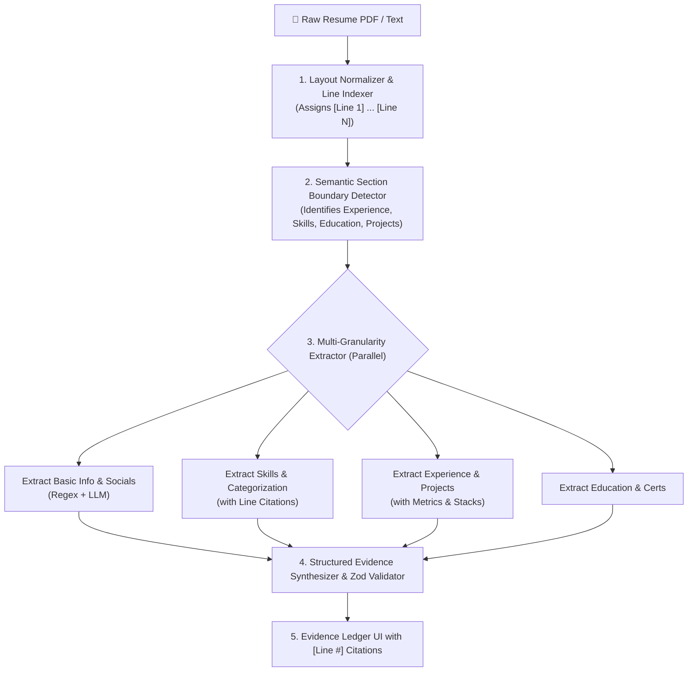

# 📑 Alibaba SmartResume Integration Master Plan

> **Objective:** Port the architectural breakthroughs of [Alibaba SmartResume](https://github.com/alibaba/SmartResume) (layout-aware line indexing, semantic section boundary detection, and multi-granularity extraction) into our native TypeScript AI Skill Gap Finder engine.

---

## 1. Architectural Overview & Innovations Adopted

---

## 2. Core Modules to Build

### Module 1: Line Indexer & Section Boundary Detector (`lib/smart-resume/section-detector.ts`)
- **Reading Order & Line Numbering:** Normalizes PDF text into clean, non-empty lines prefixed with `[L01]`, `[L02]`, etc.
- **Header Anchors:** Detects standard section headers (`EXPERIENCE`, `WORK HISTORY`, `SKILLS`, `TECHNICAL COMPETENCIES`, `EDUCATION`, `PROJECTS`, `CERTIFICATIONS`, `PUBLICATIONS`, `AWARDS`).
- **Section Slicing:** Maps line ranges for each section so prompts receive cleanly bounded text, eliminating cross-section hallucinations.

### Module 2: Multi-Granularity Extractors (`lib/smart-resume/multi-extractor.ts`)
- **Basic Info Extractor:** High-precision regex + LLM extraction for contact details, GitHub/LinkedIn URLs, portfolio links.
- **Skill Citation Extractor:** Extracts skills and attaches the exact `[Line X]` citation index.
- **Experience & Metric Extractor:** Extracts job titles, companies, dates, technologies, bullet points, and measurable impact metrics (`[Line Y]`).
- **Project Extractor:** Extracts project titles, tech stacks, live links, and outcomes.

### Module 3: Native SmartResume Analyzer (`lib/smart-resume/smart-analyzer.ts`)
- Master TypeScript class orchestrating the pipeline with parallel execution, fallback handling, and Zod validation.

### Module 4: UI Line Citation Enhancements (`app/page.tsx`)
- Displays `[Line #]` badges next to evidence quotes in the Evidence Ledger table and skill cards.

---

## 3. Step-by-Step Implementation Roadmap

| Step | File | Purpose |
|---|---|---|
| **Step 1** | `types/index.ts` | Add `lineCitations?: number[]` and `sourceLine?: string` to `SkillSchema`, `ExperienceSchema`, and `ProjectSchema` |
| **Step 2** | `lib/smart-resume/section-detector.ts` | Implement line-indexing and section anchor detection |
| **Step 3** | `lib/smart-resume/multi-extractor.ts` | Multi-granularity extraction prompts with line citations |
| **Step 4** | `lib/smart-resume/smart-analyzer.ts` | Unified TypeScript SmartResume engine |
| **Step 5** | `app/api/extract/route.ts` & `app/api/pipeline/route.ts` | Integrate SmartResume engine into master pipeline |
| **Step 6** | `app/page.tsx` | Render interactive `[Line #]` citations on the Evidence Ledger table |
| **Step 7** | Verification | Run automated build & live PDF parsing verification |

---

## 4. Verification & Evaluation Plan

1. **Precision Check:** Test on multi-column and multi-page technical resumes.
2. **Citation Accuracy:** Verify that `[Line #]` points to the exact line in the raw resume text.
3. **End-to-End Test:** Run `npm run test:api` and `npm run build`.
